---
## Front matter
title: "Лабораторная работа № 2. Простые сети в GNS3. Анализ трафика"
subtitle: "Отчет"
author: "Анна Александровна Глушенок"

## Generic options
lang: ru-RU
toc-title: "Содержание"

## Pdf output format
toc: true
toc-depth: 2
lof: true
lot: false
fontsize: 12pt
linestretch: 1.5
papersize: a4
documentclass: scrreprt

## I18n babel
babel-lang: russian
babel-otherlangs: english

## Fonts
mainfont: Liberation Serif
sansfont: Liberation Sans
monofont: Liberation Mono

## Pandoc-crossref LaTeX customization
figureTitle: "Рис."
tableTitle: "Таблица"
lofTitle: "Список иллюстраций"

## Misc options
indent: true
header-includes:
  - \usepackage{indentfirst}
  - \usepackage{float}
  - \floatplacement{figure}{H}
---

# Цель работы

Построение простейших моделей сети на базе коммутатора и маршрутизаторов FRR и VyOS в GNS3, анализ трафика посредством Wireshark.

# Задание

Для блока "Моделирование простейшей сети на базе коммутатора в GNS3":
1. Построить в GNS3 топологию сети, состоящей из коммутатора Ethernet и двух оконечных устройств (персональных компьютеров).
2. Задать оконечным устройствам IP-адреса в сети 192.168.1.0/24. Проверить связь.

Для блока "Анализ трафика в GNS3 посредством Wireshark":
1. С помощью Wireshark захватить и проанализировать ARP-сообщения.
2. С помощью Wireshark захватить и проанализировать ICMP-сообщения.

Для блока "Моделирование простейшей сети на базе маршрутизатора FRR в GNS3":
1. Построить в GNS3 топологию сети, состоящей из маршрутизатора FRR, коммутатора Ethernet и оконечного устройства.
2. Задать оконечному устройству IP-адрес в сети 192.168.1.0/24.
3. Присвоить интерфейсу маршрутизатора адрес 192.168.1.1/24
4. Проверить связь.

Для блока "Моделирование простейшей сети на базе маршрутизатора VyOS в GNS3":
1. Построить в GNS3 топологию сети, состоящей из маршрутизатора VyOS, ком-
мутатора Ethernet и оконечного устройства.
2. Задать оконечному устройству IP-адрес в сети 192.168.1.0/24.
3. Присвоить интерфейсу маршрутизатора адрес 192.168.1.1/24
4. Проверить связь.

# Выполнение лабораторной работы

## Моделирование простейшей сети на базе коммутатора в GNS3

1. Запустите GNS3 VM и GNS3. Создайте новый проект
2. В рабочей области GNS3 разместите коммутатор и два VPCS. Измените название устройств, включив имя учётной записи студента. Соедините VPCS с коммутатором. Отобразите обозначение интерфейсов соединения

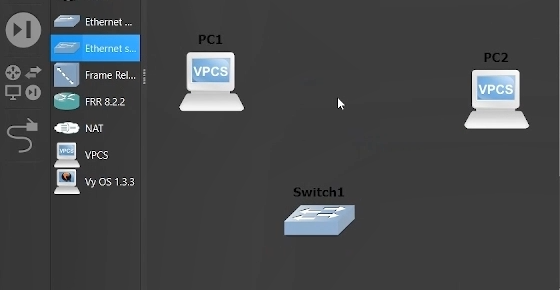{#fig:001 width=60%}

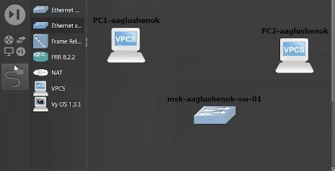{#fig:002 width=60%}

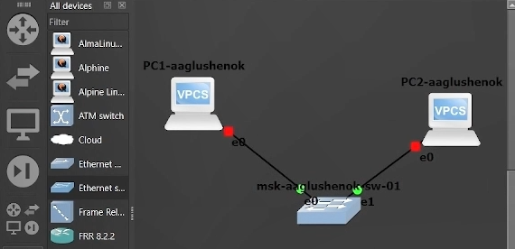{#fig:003 width=60%}

3. Запустите Start, затем вызовите Console. Просмотрите синтаксис возможных  команд. Задайте IP-адрес 192.168.1.11 в сети 192.168.1.0/24, для сохранения введите save. Аналогичным образом задайте IP-адрес 192.168.1.12 для PC-2

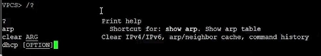{#fig:004 width=60%}

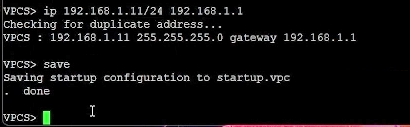{#fig:005 width=60%}

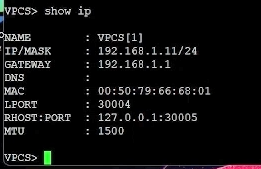{#fig:006 width=60%}

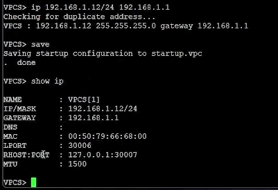{#fig:007 width=60%}

4. Проверьте работоспособность соединения между PC-1 и PC-2 с помощью команды ping

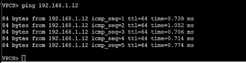{#fig:008 width=60%}

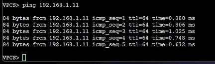{#fig:009 width=60%}

5. Остановите в проекте все узлы (меню GNS3 Control Stop all nodes )

## Анализ трафика в GNS3 посредством Wireshark

1. Запустите на соединении между PC-1 и коммутатором анализатор трафика. Запустится Wireshark, в проекте GNS3 на соединении появится значок лупы

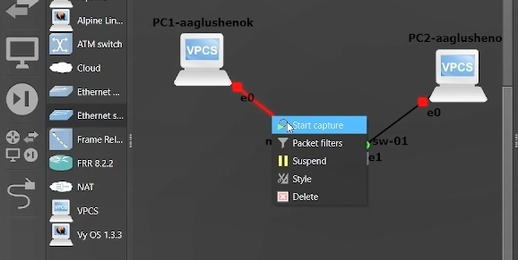{#fig:010 width=60%}

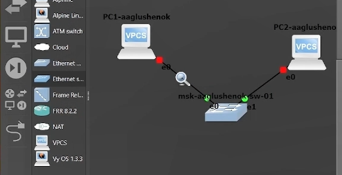{#fig:011 width=60%}

2. В проекте стартуйте все узлы. В окне Wireshark отобразится информация по протоколу ARP

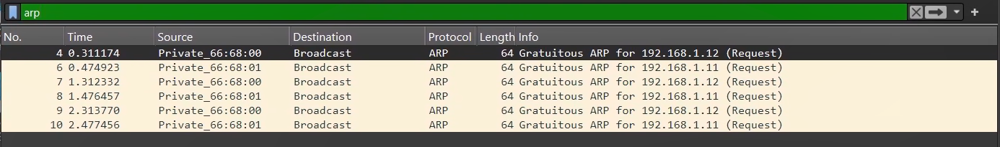{#fig:012 width=60%}

В окне WireShark Мы получили список ARP-запросов. Устройства рассылают Gratuitous ARP (широковещательные запросы), чтобы объявить свои IP-адреса и проверить их уникальность в сети. Это стандартное поведение при старте узлов.

3. В терминале PC-2 посмотрите информацию по опциям команды ping, затем сделайте один эхо-запрос в ICMP-моде к узлу PC-1

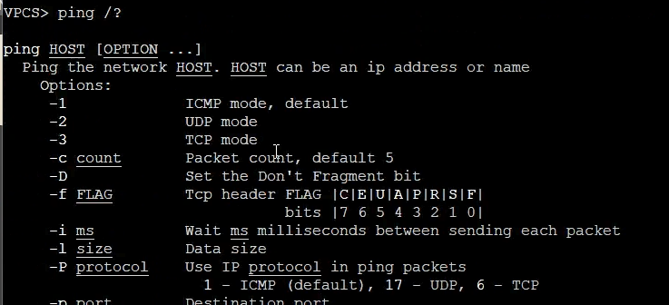{#fig:013 width=60%}

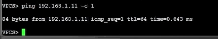{#fig:014 width=60%}

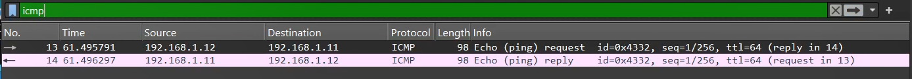{#fig:015 width=60%}

В окне Wireshark мы видим обмен пакетами между PC-2 (192.168.1.12) и PC-1 (192.168.1.11). PC-2 отправляет Echo (ping) request (запрос), а PC-1 отвечает Echo (ping) reply (ответ). Это стандартный механизм проверки доступности узла в сети.

4. Сделайте один эхо-запрос в UDP-моде к узлу PC-1

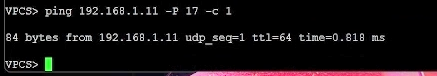{#fig:016 width=60%}

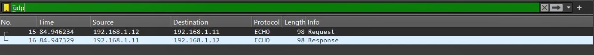{#fig:017 width=60%}

В окне Wireshark мы видим обмен пакетами между PC-2 (192.168.1.12) и PC-1 (192.168.1.11). PC-2 отправляет Request (запрос), а PC-1 отвечает Response (ответ). Это показывает передачу данных без установления соединения (UDP), в отличие от ICMP, где проверяется доступность.

5. Сделайте один эхо-запрос в TCP-моде к узлу PC-1

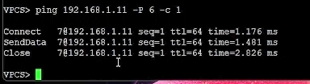{#fig:018 width=60%}

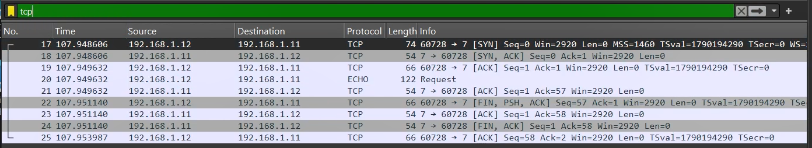{#fig:019 width=60%}

В окне Wireshark мы видим процесс установки соединения между PC-2 (192.168.1.12) и PC-1 (192.168.1.11). Сначала идет трехстороннее рукопожатие: PC-2 отправляет [SYN], PC-1 отвечает [SYN, ACK], а PC-2 подтверждает [ACK]. Затем происходит обмен данными (Request/Response) и корректное завершение сессии через пакеты [FIN, ACK]. Это показывает надежную передачу данных с установлением и разрывом соединения.

6. Остановите захват пакетов в Wireshark

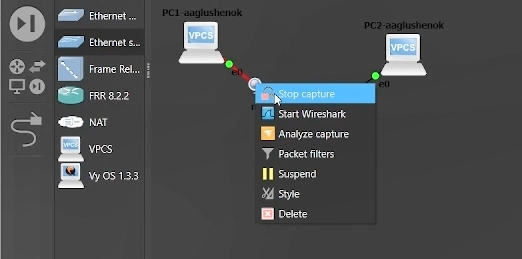{#fig:020 width=60%}

## Моделирование простейшей сети на базе маршрутизатора FRR в GNS3

1. Запустите GNS3 VM и GNS3. Создайте новый проект
2. В рабочей области GNS3 разместите VPCS, коммутатор и маршрутизатор FRR 
3. Измените отображаемые названия устройств
4. Включите захват трафика на соединении между коммутатором и маршрутизатором

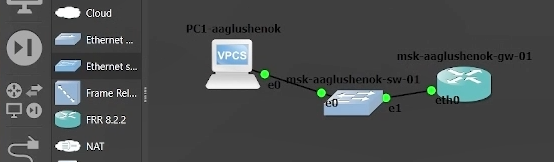{#fig:021 width=60%}

5. Запустите все устройства проекта. Откройте консоль всех устройств проекта
6. Настройте IP-адресацию для интерфейса узла PC1

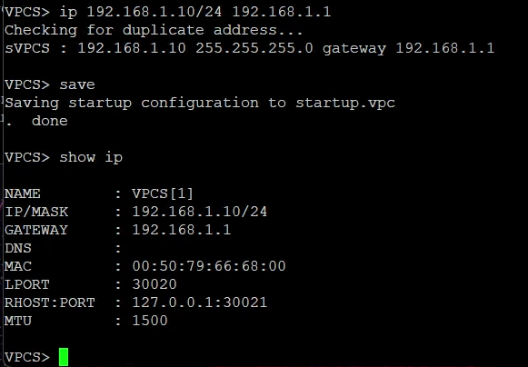{#fig:022 width=60%}

7. Настройте IP-адресацию для интерфейса локальной сети маршрутизатора

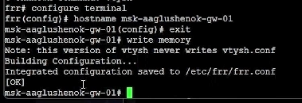{#fig:023 width=60%}

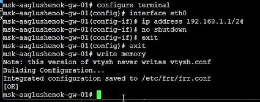{#fig:024 width=60%}

8. Проверьте конфигурацию маршрутизатора и настройки IP-адресации

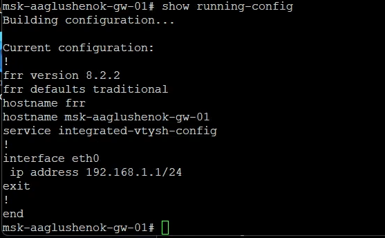{#fig:025 width=60%}

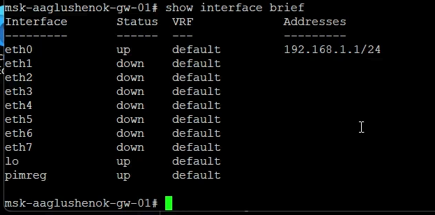{#fig:026 width=60%}

9. Проверьте подключение. Узел PC1 должен успешно отправлять эхо-запросы на адрес маршрутизатора 192.168.1.1
10. В окне Wireshark проанализируйте полученную информацию

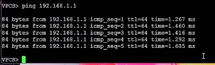{#fig:027 width=60%}

В окне Wireshark мы видим обмен пакетами между PC-1 (192.168.1.12) и маршрутизатором (192.168.1.1). PC-1 отправляет Echo (ping) request (запрос), а маршрутизатор отвечает Echo (ping) reply (ответ). Это подтверждает успешную проверку доступности шлюза.

11. Остановите захват пакетов в Wireshark. Остановите все устройства в проекте

## Моделирование простейшей сети на базе маршрутизатора VyOS в GNS3

1. Запустите GNS3 VM и GNS3. Создайте новый проект
2. В рабочей области GNS3 разместите VPCS, коммутатор и маршрутизатор VyOS 
3. Измените отображаемые названия устройств
4. Включите захват трафика на соединении между коммутатором и маршрутизатором

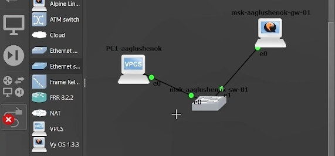{#fig:028 width=60%}

5. Запустите все устройства проекта. Откройте консоль всех устройств проекта
6. Настройте IP-адресацию для интерфейса узла PC1

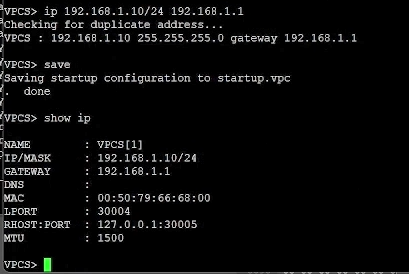{#fig:029 width=60%}

7. Настройте маршрутизатор VyOS. Изменения в имени устройства вступят в силу после применения и сохранения конфигурации и перезапуска устройства

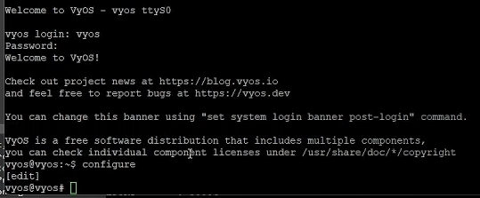{#fig:030 width=60%}

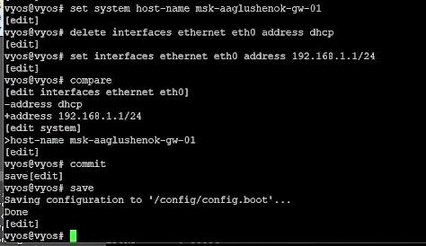{#fig:031 width=60%}

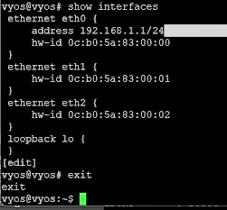{#fig:032 width=60%}

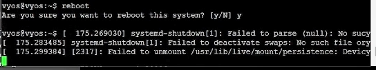{#fig:033 width=60%}

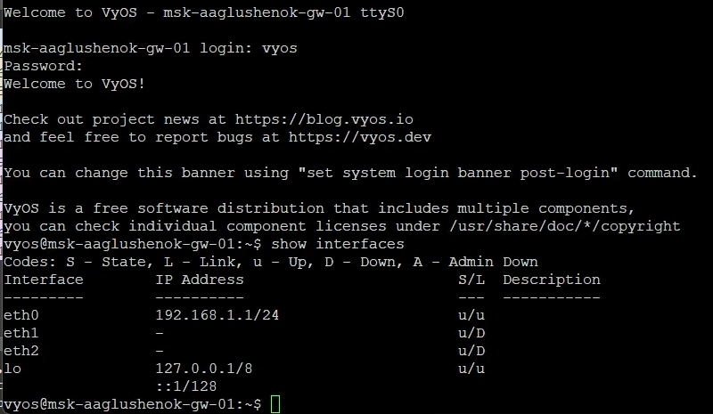{#fig:034 width=60%}

8. Проверьте подключение. Узел PC1 должен успешно отправлять эхо-запросы на адрес маршрутизатора 192.168.1.1
9. В окне Wireshark проанализируйте полученную информацию

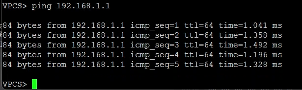{#fig:035 width=60%}

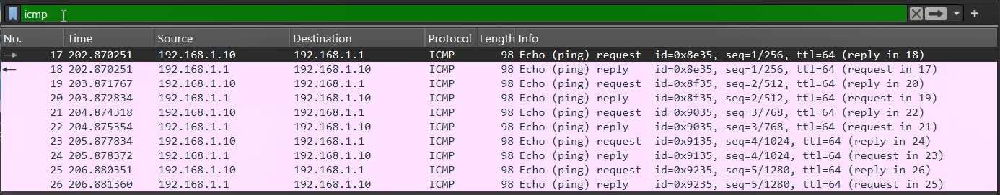{#fig:036 width=60%}

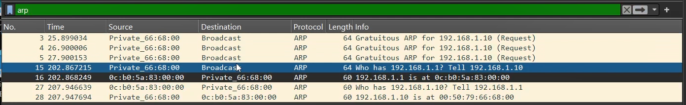{#fig:037 width=60%}

В окне Wireshark мы видим два этапа. Сначала зафиксированы ARP-запросы: PC-1 (192.168.1.10) рассылает Gratuitous ARP для проверки своего адреса, а затем отправляет широковещательный запрос Who has 192.168.1.1? для определения MAC-адреса маршрутизатора, на который получает ответ. Далее идет ICMP-обмен: PC-1 отправляет Echo (ping) request на адрес 192.168.1.1, а маршрутизатор отвечает Echo (ping) reply. Это подтверждает успешную проверку доступности шлюза.

10. Остановите захват пакетов в Wireshark. Остановите все устройства в проекте. Завершите работу с GNS3

# Выводы

В ходе выполнения лабораторной работы № 2 мне удалось построить простейшие модели сети на базе коммутатора и маршрутизаторов FRR и VyOS в GNS3, провести анализ трафика посредством Wireshark.
