# Информация

## Докладчик

::::: {.columns align="center"}
::: {.column width="70%"}
- Глушенок Анна Александровна
- Студент НПИбд-01-24
- Российский университет дружбы народов
- <1132246844@pfur.ru>
:::

::: {.column width="30%"}
:::
:::::

## Цель работы

Изучение принципов организации адресного пространства.

## Задание

Разбиение сети на подсети

- Разбиение IPv4-сети на подсети
- Разбиение IPv6-сети на подсети

# Выполнение лабораторной работы

# Разбиение IPv4-сети на подсети

## Разбиение IPv4-сети на подсети

1.  Заданы IPv4-сети: 172.16.20.0/24, 10.10.1.64/26, 10.10.1.0/26. Для
    заданных сетей определите: префикс, маску, количество бит узла,
    количество адресов, количество адресов узлов, адрес сети, Broadcast,
    диапазон узлов.

## Разбиение IPv4-сети на подсети

а) Составляем таблицу, которая содержит наименование каждого параметра
из условия, его определение и способ нахождения для заданной сети

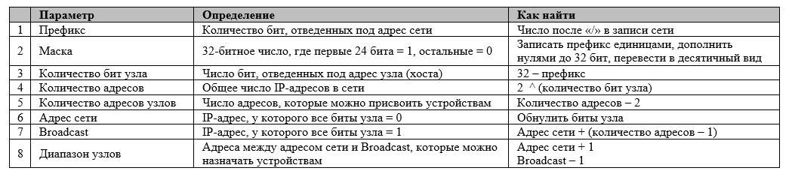{#fig:001
width="80%"}

## Разбиение IPv4-сети на подсети

б) Следуя таблице, определяем параметры для каждой из сетей

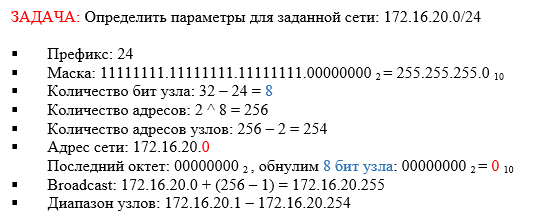{#fig:002
width="50%"}

## Разбиение IPv4-сети на подсети

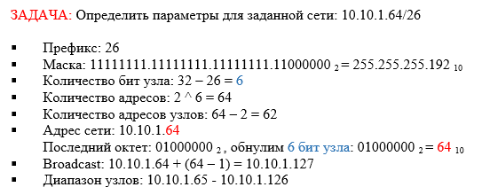{#fig:003
width="50%"}

## Разбиение IPv4-сети на подсети

{#fig:004
width="50%"}

## Разбиение IPv4-сети на подсети

2.  Заданную IPv4-сеть 172.16.20.0/24, разбейте сеть на 3 подсети с
    максимально возможным числом адресов узлов 126, 62, 62
    соответственно.

## Разбиение IPv4-сети на подсети

а) Составляем таблицу, которая содержит наименование каждого параметра,
необходимого для разбиения сети на подсети, его определение и способ
нахождения для заданной сети

{#fig:005
width="80%"}

## Разбиение IPv4-сети на подсети

б) Следуя таблице, определяем параметры для каждой из подсетей

{#fig:006
width="50%"}

## Разбиение IPv4-сети на подсети

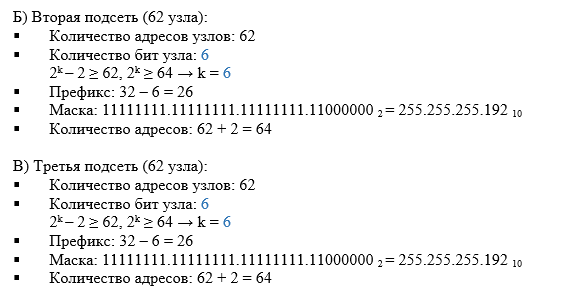{#fig:007
width="50%"}

## Разбиение IPv4-сети на подсети

в) Распределяем адресное пространство между подсетями, записываем
характеристики выделенных подсетей

{#fig:008 width="60%"}

## Разбиение IPv4-сети на подсети

{#fig:009 width="70%"}

## Разбиение IPv4-сети на подсети

3.  В заданной IPv4-сети 10.10.1.64/26 выделите подсеть на 30 узлов.
    Запишите характеристики для выделенной подсети.

## Разбиение IPv4-сети на подсети

а) Следуя таблице, определяем параметры подсети

{#fig:010 width="60%"}

## Разбиение IPv4-сети на подсети

б) Выделяем подсеть и записываем ее характеристики

{#fig:011 width="70%"}

## Разбиение IPv4-сети на подсети

4.  В заданной IPv4-сети 10.10.1.0/26 выделите подсеть на 14 узлов.
    Запишите характеристики для выделенной подсети.

## Разбиение IPv4-сети на подсети

а) Следуя таблице, определяем параметры подсети

{#fig:012 width="70%"}

## Разбиение IPv4-сети на подсети

б) Выделяем подсеть и записываем ее характеристики

{#fig:013 width="70%"}

# Разбиение IPv6-сети на подсети

## Разбиение IPv6-сети на подсети

1.  Заданы IPv6-сети: 2001:db8:c0de::/48, 2a02:6b8::/64. Для заданных
    сетей определите: префикс, маску, адрес сети, Broadcast, диапазон
    узлов.

## Разбиение IPv6-сети на подсети

а) Составляем таблицу, которая содержит наименование каждого параметра
из условия, его определение и способ нахождения для заданной сети

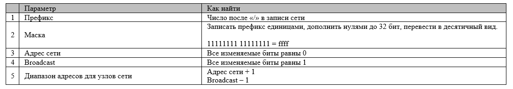{#fig:014
width="80%"}

## Разбиение IPv6-сети на подсети

б) Следуя таблице, определяем параметры для каждой из сетей

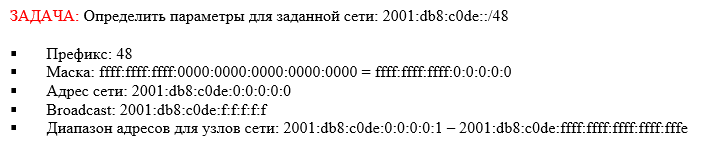{#fig:015
width="70%"}

## Разбиение IPv6-сети на подсети

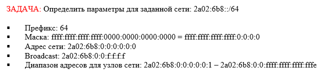{#fig:016
width="70%"}

## Разбиение IPv6-сети на подсети

2.  Заданную IPv6-сеть 2001:db8:c0de::/48, разбейте на 2 подсети двумя
    способами --- с использованием идентификатора подсети и с
    использованием идентификатора интерфейса.

## Разбиение IPv6-сети на подсети

а) Расчитываем параметры подсети для метода с использованием
идентификатора подсети

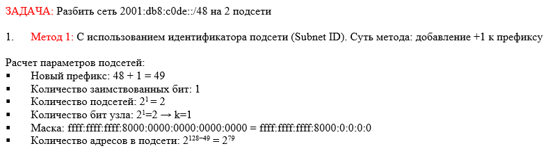{#fig:017
width="70%"}

## Разбиение IPv6-сети на подсети

б) Выделяем подсети и записываем их характеристики

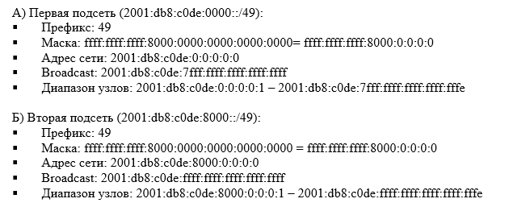{#fig:018
width="60%"}

## Разбиение IPv6-сети на подсети

в) Расчитываем параметры подсети для метода с использованием
идентификатора интерфейса

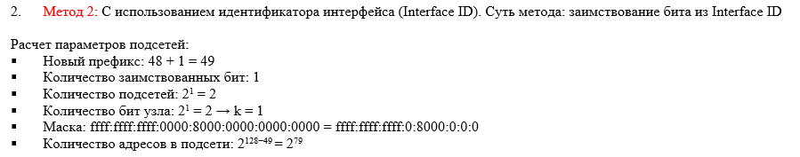{#fig:019
width="80%"}

## Разбиение IPv6-сети на подсети

г) Выделяем подсети и записываем их характеристики

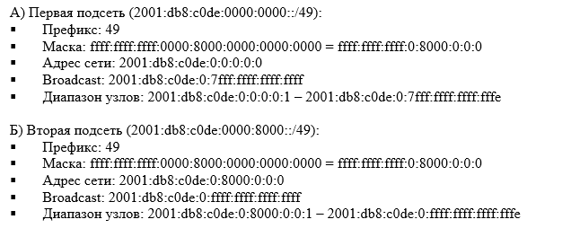{#fig:020
width="60%"}

## Разбиение IPv6-сети на подсети

д) Делаем вывод

{#fig:021 width="90%"}

## Разбиение IPv6-сети на подсети

2.  Заданную IPv6-сеть 2a02:6b8::/64, разбейте на 2 подсети двумя
    способами --- с использованием идентификатора подсети и с
    использованием идентификатора интерфейса.

## Разбиение IPv6-сети на подсети

а) Расчитываем параметры подсети для метода с использованием
идентификатора подсети

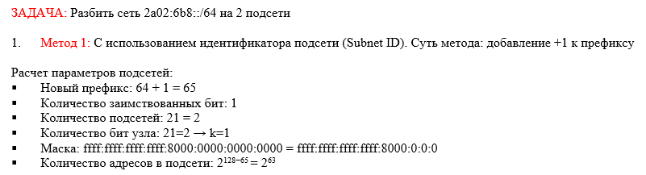{#fig:022
width="70%"}

## Разбиение IPv6-сети на подсети

б) Выделяем подсети и записываем их характеристики

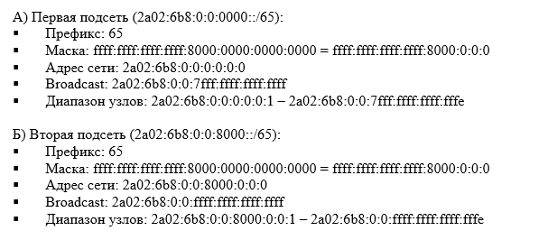{#fig:023
width="60%"}

## Разбиение IPv6-сети на подсети

в) Расчитываем параметры подсети для метода с использованием
идентификатора интерфейса

{#fig:024
width="80%"}

## Разбиение IPv6-сети на подсети

г) Выделяем подсети и записываем их характеристики

{#fig:025
width="60%"}

## Разбиение IPv6-сети на подсети

д) Делаем вывод

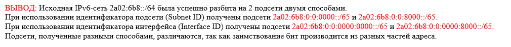{#fig:026 width="80%"}

## Выводы

В ходе выполнения лабораторной работы № 3 мне удалось изучить принципы
организации адресного пространства.
