---
## Front matter
title: "Лабораторная работа № 3. Адресация IPv4 и IPv6"
subtitle: "Отчет"
author: "Анна Александровна Глушенок"

## Generic options
lang: ru-RU
toc-title: "Содержание"

## Pdf output format
toc: true
toc-depth: 2
lof: true
lot: false
fontsize: 12pt
linestretch: 1.5
papersize: a4
documentclass: scrreprt

## I18n babel
babel-lang: russian
babel-otherlangs: english

## Fonts
mainfont: Liberation Serif
sansfont: Liberation Sans
monofont: Liberation Mono

## Pandoc-crossref LaTeX customization
figureTitle: "Рис."
tableTitle: "Таблица"
lofTitle: "Список иллюстраций"

## Misc options
indent: true
header-includes:
  - \usepackage{indentfirst}
  - \usepackage{float}
  - \floatplacement{figure}{H}
---

# Цель работы

Изучение принципов организации адресного пространства.

# Задание

Разбиение сети на подсети
- Разбиение IPv4-сети на подсети
- Разбиение IPv6-сети на подсети

# Выполнение лабораторной работы

## Разбиение IPv4-сети на подсети

1. Заданы IPv4-сети: 172.16.20.0/24, 10.10.1.64/26, 10.10.1.0/26. Для заданных сетей определите: префикс, маску, количество бит узла, количество адресов, количество адресов узлов, адрес сети, Broadcast, диапазон узлов.

а) Составляем таблицу, которая содержит наименование каждого параметра из условия, его определение и способ нахождения для заданной сети

{#fig:001 width=60%}

б) Следуя таблице, определяем параметры для каждой из сетей

{#fig:002 width=60%}

{#fig:003 width=60%}

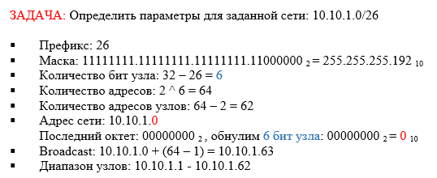{#fig:004 width=60%}

2. Заданную IPv4-сеть 172.16.20.0/24, разбейте сеть на 3 подсети с максимально возможным числом адресов узлов
126, 62, 62 соответственно.

а) Составляем таблицу, которая содержит наименование каждого параметра, необходимого для разбиения сети на подсети, его определение и способ нахождения для заданной сети

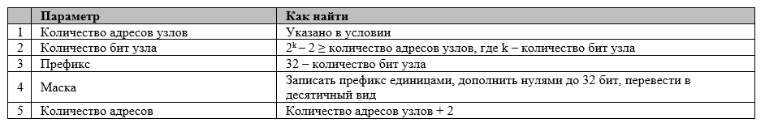{#fig:005 width=60%}

б) Следуя таблице, определяем параметры для каждой из подсетей

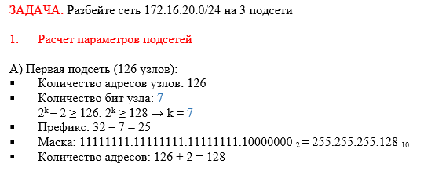{#fig:006 width=60%}

{#fig:007 width=60%}

в) Распределяем адресное пространство между подсетями, записываем характеристики выделенных подсетей

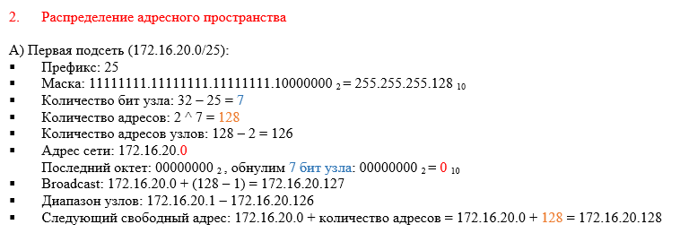{#fig:008 width=60%}

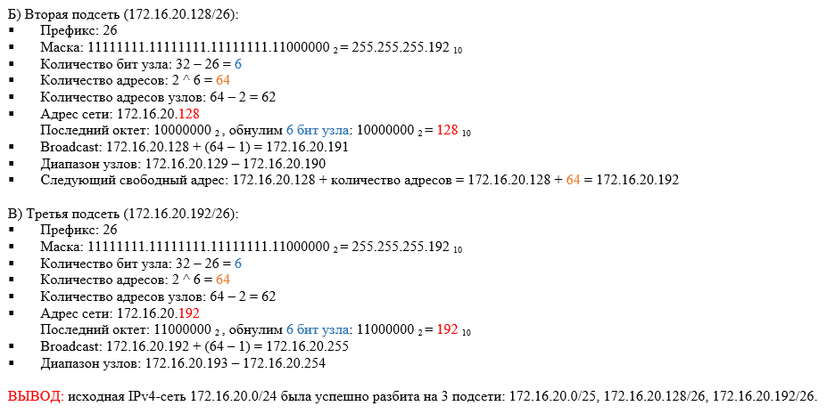{#fig:009 width=60%}

3. В заданной IPv4-сети 10.10.1.64/26 выделите подсеть на 30 узлов. Запишите характеристики для выделенной
подсети.

а) Следуя таблице, определяем параметры  подсети

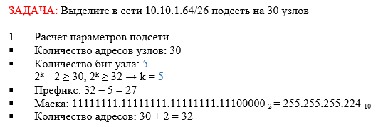{#fig:010 width=60%}

б) Выделяем подсеть и записываем ее характеристики

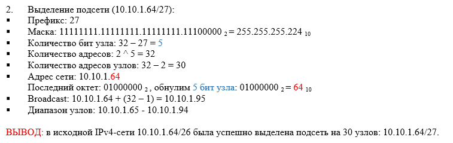{#fig:011 width=60%}

4. В заданной IPv4-сети 10.10.1.0/26 выделите подсеть на 14 узлов. Запишите характеристики для выделенной
подсети.

а) Следуя таблице, определяем параметры  подсети

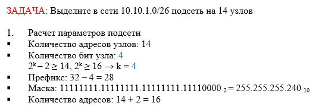{#fig:012 width=60%}

б) Выделяем подсеть и записываем ее характеристики

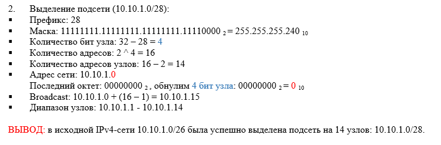{#fig:013 width=60%}

## Разбиение IPv6-сети на подсети

1. Заданы IPv6-сети: 2001:db8:c0de::/48, 2a02:6b8::/64. Для заданных сетей определите: префикс, маску, адрес сети, Broadcast, диапазон узлов.

а) Составляем таблицу, которая содержит наименование каждого параметра из условия, его определение и способ нахождения для заданной сети

{#fig:014 width=60%}

б) Следуя таблице, определяем параметры для каждой из сетей

{#fig:015 width=60%}

{#fig:016 width=60%}

2. Заданную IPv6-сеть 2001:db8:c0de::/48, разбейте на 2 подсети двумя способами — с использованием идентификатора подсети и с использованием идентификатора интерфейса. 

а) Расчитываем параметры подсети для метода с использованием идентификатора подсети

{#fig:017 width=60%}

б) Выделяем подсети и записываем их характеристики

{#fig:018 width=60%}

в) Расчитываем параметры подсети для метода с использованием идентификатора интерфейса

{#fig:019 width=60%}

г) Выделяем подсети и записываем их характеристики

{#fig:020 width=60%}

д) Делаем вывод

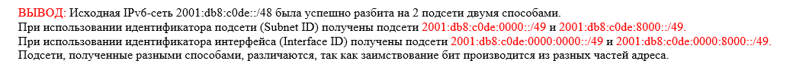{#fig:021 width=60%}

2. Заданную IPv6-сеть 2a02:6b8::/64, разбейте на 2 подсети двумя способами — с использованием идентификатора подсети и с использованием идентификатора интерфейса. 

а) Расчитываем параметры подсети для метода с использованием идентификатора подсети

{#fig:022 width=60%}

б) Выделяем подсети и записываем их характеристики

{#fig:023 width=60%}

в) Расчитываем параметры подсети для метода с использованием идентификатора интерфейса

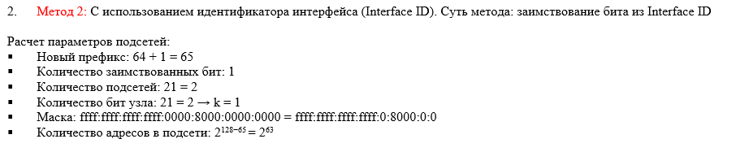{#fig:024 width=60%}

г) Выделяем подсети и записываем их характеристики

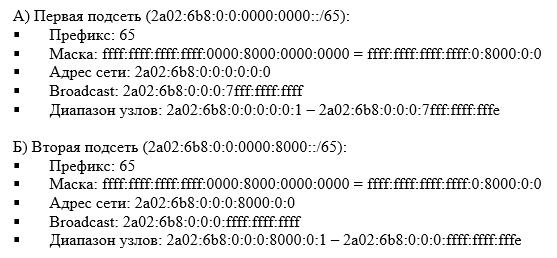{#fig:025 width=60%}

д) Делаем вывод

{#fig:026 width=60%}

# Выводы

В ходе выполнения лабораторной работы № 3 мне удалось изучить принципы организации адресного пространства.
