---
## Front matter
lang: ru-RU
title: Домашняя работа № 3. Анализ трафика в Wireshark
subtitle: Презентация
author:
  - Глушенок А. А.
institute:
  - Российский университет дружбы народов, Москва, Россия
date: 10 октября 2026

## Formatting pdf
toc: false
slide_level: 2
aspectratio: 169
section-titles: true
theme: metropolis
header-includes:
 - \metroset{progressbar=frametitle,sectionpage=progressbar,numbering=fraction}
 - \usepackage{graphicx}
 - \usepackage{caption}
 - \captionsetup{labelformat=empty, labelsep=none}
 
## Fonts
mainfont: Liberation Serif
sansfont: PT Sans
monofont: Liberation Mono
---

# Информация

## Докладчик

:::::::::::::: {.columns align=center}
::: {.column width="70%"}

  * Глушенок Анна Александровна
  * Студент НПИбд-01-24
  * Российский университет дружбы народов
  * [1132246844@pfur.ru](mailto:1132246844@pfur.ru)

:::
::: {.column width="30%"}

:::
::::::::::::::

## Цель работы

Изучение посредством Wireshark кадров Ethernet, анализ UDP протоколов транспортного и прикладного уровней стека TCP/IP.

## Задание

MAC-адресация

1. Изучение возможностей команды ipconfig для ОС типа Windows (ifconfig для систем типа Linux).
2. Определение MAC-адреса устройства и его типа.

Анализ кадров канального уровня в Wireshark

1. Установить на домашнем устройстве Wireshark.
2. С помощью Wireshark захватить и проанализировать пакеты ARP и ICMP в части кадров канального уровня.

## Задание

Анализ протоколов транспортного уровня в Wireshark

1. С помощью Wireshark захватить и проанализировать пакеты HTTP, DNS в части
заголовков и информации протоколов TCP, UDP, QUIC.

Анализ handshake протокола TCP в Wireshark

1. С помощью Wireshark проанализировать handshake протокола TCP.

# Выполнение лабораторной работы

# MAC-адресация

## MAC-адресация

1. С помощью команды ipconfig для ОС  Windows выведите информацию о текущем сетевом соединении. Используйте разные опции команды. 

ipconfig /? — выводит справку по команде и список всех её параметров.  
ipconfig /all — показывает подробную информацию: MAC-адреса, DHCP, DNS-серверы, аренда адреса и т.д.  
ipconfig — показывает базовую информацию о сетевых адаптерах: IP-адрес, маску подсети и основной шлюз.  

## MAC-адресация

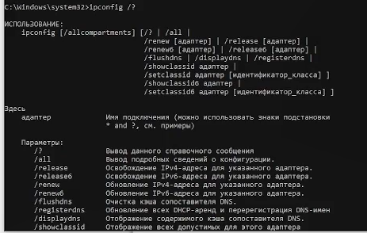{#fig:001 width=60%}

## MAC-адресация

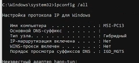{#fig:002 width=60%}

## MAC-адресация

{#fig:003 width=60%}

## MAC-адресация

{#fig:004 width=60%}

## MAC-адресация

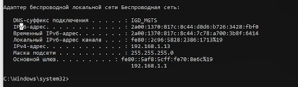{#fig:005 width=60%}

## MAC-адресация

2. Определите MAC-адреса сетевых интерфейсов на вашем компьютере. 

В выводе команды ipconfig /all смотрим строку: "Физический адрес: E0 - D0 - 45 - 44 - 46 - AC".

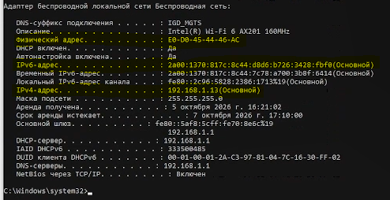{#fig:026 width=50%}

## MAC-адресация

3. Опишите структуру MAC-адресов вашего устройства.

Какая часть адреса идентифицирует производителя? - первые 3 байта (E0 - D0 - 45)  
Какая часть адреса идентифицирует сетевой интерфейс? - последнипе 3 байта (44 - 46 - AC)  
Определите, каким является адрес — индивидуальным или групповым? - индивидуальный, тк первый младший бит первого байта в двоичной системе равен 0 (E0 = 1110 000**0**)   
Определите, каким является адрес - глобально администрируемым или локально администрируемым?  - глобально администрируемый, тк второй младший бит первого байта в двоичной системе равен 0 (E0 = 1110 00**0**0)   

# Анализ кадров канального уровня в Wireshark

## Анализ кадров канального уровня в Wireshark

1. Установите на вашем устройстве Wireshark.
2. Запустите Wireshark. Выберите активный на вашем устройстве сетевой интерфейс.
3. На вашем устройстве в консоли определите с помощью команды ipconfig для ОС типа Windows IP-адрес вашего
устройства (IPv4-адрес: 192.168.1.13 (основной)) и шлюз по умолчанию (Основной шлюз: 192.168.1.1).

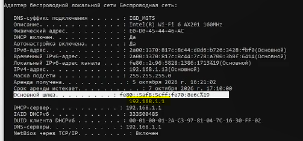{#fig:006 width=50%}

## Анализ кадров канального уровня в Wireshark

4. На вашем устройстве в консоли с помощью команды ping адрес_шлюза пропингуйте шлюз по умолчанию. 

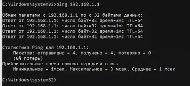{#fig:007 width=60%}

## Анализ кадров канального уровня в Wireshark

5. В Wireshark остановите захват трафика. В строке фильтра пропишите arp or icmp. Убедитесь, что в списке пакетов отобразятся только пакеты ARP или ICMP, в частности пакеты, которые были сгенерированы с помощью команды ping.

{#fig:08 width=60%}

## Анализ кадров канального уровня в Wireshark

6. Выберите первый указанный кадр ICMP — эхо-запрос. 

Длина кадра - Frame Length: 74 bytes (592 bits)  
K какому типу Ethernet относится кадр - Ethernet II  
MAC-адреса источника - Source: Intel_44:46:ac (e0:d0:45:44:46:ac)  
MAC-адреса шлюза - Destination: LLCProizvods_70:8e:6c (58:f8:5c:70:8e:6c)  
Тип MAC-адресов - индивидуальные, тк  у обоих адресов младший бит первого байта равен 0 (e0 = 1110 0000, 58 = 0101 1000)  

## Анализ кадров канального уровня в Wireshark

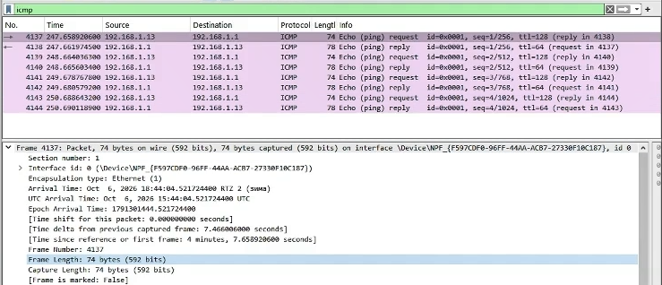{#fig:09 width=60%}

## Анализ кадров канального уровня в Wireshark

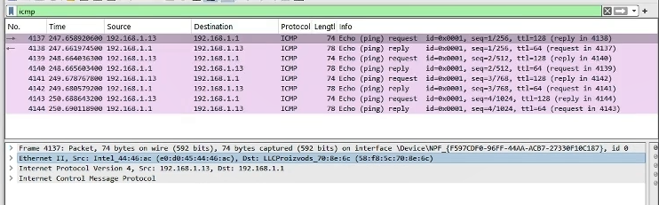{#fig:010 width=60%}

## Анализ кадров канального уровня в Wireshark

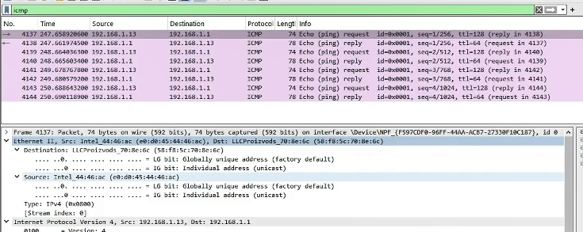{#fig:011 width=60%}

## Анализ кадров канального уровня в Wireshark

6. Выберите второй указанный кадр ICMP — эхо-ответ. 

{#fig:012 width=60%}

## Анализ кадров канального уровня в Wireshark

Длина кадра - Frame Length: 78 bytes (624 bits)  
K какому типу Ethernet относится кадр - Ethernet II  
MAC-адреса источника - Source: LLCProizvods_70:8e:6c (58:f8:5c:70:8e:6c)  
MAC-адреса шлюза - Destination: Intel_44:46:ac (e0:d0:45:44:46:ac)  
Тип MAC-адресов - индивидуальные, тк  у обоих адресов младший бит первого байта равен 0 (e0 = 1110 0000, 58 = 0101 1000)  

## Анализ кадров канального уровня в Wireshark

7. Изучите кадры данных протокола ARP. Изучите данные в полях заголовка Ethernet II.  
Основная информация в Ethernet 2 - адреса Source (источника) и Destination (получаетля).

{#fig:013 width=60%}

## Анализ кадров канального уровня в Wireshark

8. Начните новый процесс захвата трафика в Wireshark. На вашем устройстве пропингуйте какой-нибудь известный вам адрес: ping ya.ru.

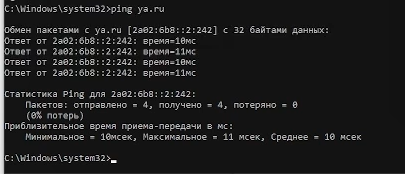{#fig:014 width=60%}

## Анализ кадров канального уровня в Wireshark

9. В Wireshark остановите захват трафика. Изучите запросы и ответы протоколов ARP и ICMP. Определите MAC-адреса источника и получателя, определите тип MAC-адресов.

При ping ya.ru на исходящих ICMP-запросах :  
- Source MAC — MAC устройства: e0:d0:45:44:46:ac (Intel_44:46:ac)  
- Destination MAC — MAC шлюза: 58:f8:5c:70:8e:6c (LLCProizvods_70:8e:6c)  

 При ping ya.ru на ответных ICMP-запросах MAC-адреса будут обратными:  
- Source MAC — MAC устройства: 58:f8:5c:70:8e:6c (LLCProizvods_70:8e:6c)  
- Destination MAC — MAC шлюза: e0:d0:45:44:46:ac (Intel_44:46:ac)  

## Анализ кадров канального уровня в Wireshark

{#fig:015 width=60%}

# Анализ протоколов транспортного уровня в Wireshark

## Анализ протоколов транспортного уровня в Wireshark

1. Запустите Wireshark. Выберите активный сетевой интерфейс. Убедитесь, что начался процесс захвата трафика.
2. В браузере перейдите на сайт, работающий по протоколу HTTP (CERN http://info.cern.ch/). Поперемещайтесь по
ссылкам или разделам сайта в браузере.

{#fig:016 width=50%}

## Анализ протоколов транспортного уровня в Wireshark

3. В строке фильтра укажите http и проанализируйте информацию по протоколу TCP в случае запросов и ответов. 

Информация по протоколу TCP (для выбранного пакета):  
- Порты: Source 55085 → Destination 80 (HTTP)  
- Флаги: PSH, ACK (0x018)  
- Seq = 1, Ack = 1, Len = 469 (данные)  
- Соединение установлено (Complete, WITH_DATA)  
- Окно: 517, Window Scale: 256  
- Контрольная сумма: unverified (checksum offload)  

## Анализ протоколов транспортного уровня в Wireshark

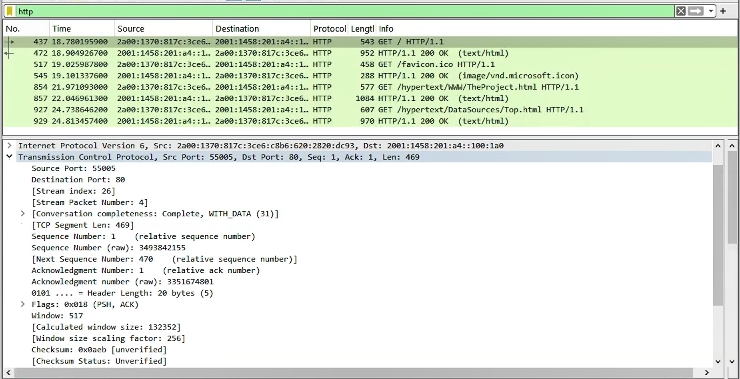{#fig:017 width=60%}

## Анализ протоколов транспортного уровня в Wireshark

4. В строке фильтра укажите dns и проанализируйте информацию по протоколу UDP в случае запросов и ответов. 

Информация по протоколу UDP (для выбранного пакета):  
- Порты: Source 53 → Destination 65458 (DNS)  
- Length: 78  
- Checksum: 0x9c9d (unverified, Checksum Status: Unverified)  
- Stream Index: 18  
- UDP payload (78 bytes)  
- Тип пакета: DNS Standard query (0x7e6c A info.cern.ch)  

## Анализ протоколов транспортного уровня в Wireshark

{#fig:018 width=60%}

## Анализ протоколов транспортного уровня в Wireshark

5. В строке фильтра укажите quic и проанализируйте информацию по протоколу quic в случае запросов и ответов. 

Информация по протоколу UDP (для выбранного пакета):  
- Packet Type: Handshake (2)  
- Version: 1 (0x00000001)  
- Header Form: Long Header  
- Destination Connection ID: 0b6b2f28141eb16  
- Source Connection ID: нет (длина 0)  
- Packet Length: 39  
- Шифрование: payload зашифрован, расшифровать не удалось (Secrets are not available)  

## Анализ протоколов транспортного уровня в Wireshark

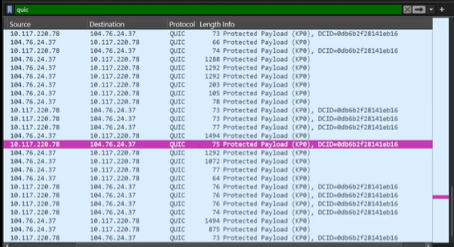{#fig:019 width=60%}

## Анализ протоколов транспортного уровня в Wireshark

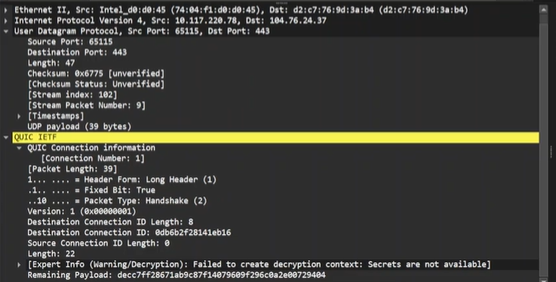{#fig:020 width=60%}

## Анализ протоколов транспортного уровня в Wireshark

6. Остановите захват трафика в Wireshark.

# Анализ handshake протокола TCP в Wireshark

## Анализ handshake протокола TCP в Wireshark

1. Запустите Wireshark. Выберите активный сетевой интерфейс.
2. На вашем устройстве используйте соединение по HTTP с каким-то сайтом для захвата в Wireshark пакетов TCP (сайт - CERN http://info.cern.ch/).
3. В Wireshark проанализируйте handshake протокола TCP.

в Wireshark, TCP-соединение  состоит из 3 пакетов  (three-way handshake) :  
- SYN — запрос клиента на установку соединения (клиент → сервер).  
- SYN, ACK — сервер подтверждает получение запроса и соглашается на соединение (сервер → клиент).  
- ACK — клиент подтверждает ответ сервера, соединение установлено (клиент → сервер).  

## Анализ handshake протокола TCP в Wireshark

![handshake, пакет [SYN]](image/21.PNG){#fig:021 width=60%}

## Анализ handshake протокола TCP в Wireshark

![handshake, пакет [SYN, ACK]](image/22.PNG){#fig:022 width=60%}

## Анализ handshake протокола TCP в Wireshark

![handshake, пакет [ACK]](image/23.PNG){#fig:023 width=60%}

## Анализ handshake протокола TCP в Wireshark

4. В Wireshark в меню «Статистика» выберете «График Потока».

На графике потока видим отображение handshake:  
- SYN — запрос клиента (порт 64470 → 80). Значение Seq = 0.  
- SYN, ACK — согласие сервера (порт 80 → 64470). Значение Seq = 0, Ack = 1.  
- ACK — подтверждение клиента (порт 64470 → 80). Значение Seq = 1, Ack = 1.  
Соединение установлено.  

## Анализ handshake протокола TCP в Wireshark

{#fig:024 width=30%}

## Анализ handshake протокола TCP в Wireshark

{#fig:025 width=60%}

## Анализ handshake протокола TCP в Wireshark

5. Остановите захват трафика в Wireshark

# Выводы

В ходе выполнения домашней работы № 3 мне удалось изучить посредством Wireshark кадры Ethernet, анализ UDP протоколов транспортного и прикладного уровней стека TCP/IP.
