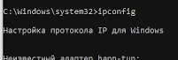
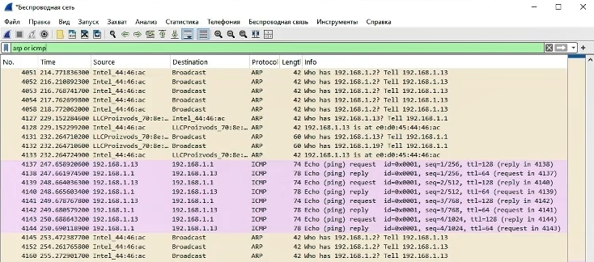
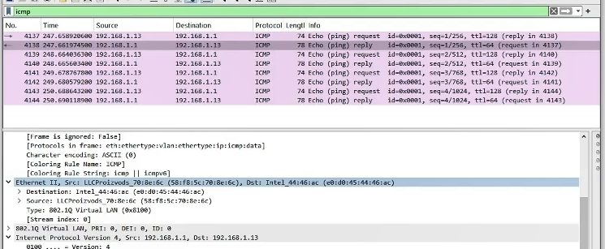
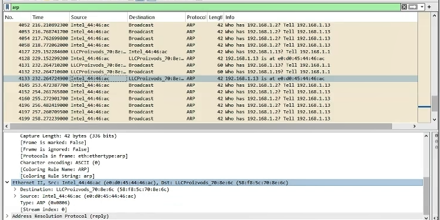
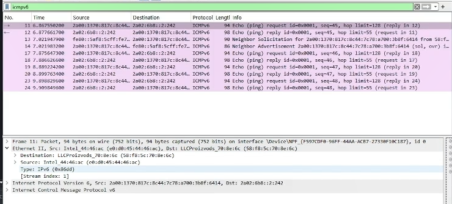
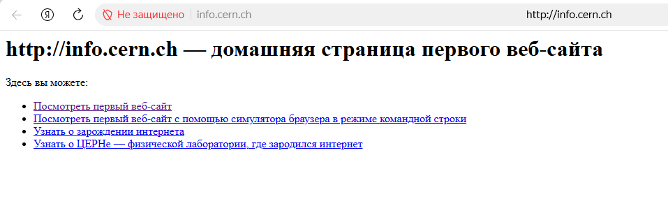
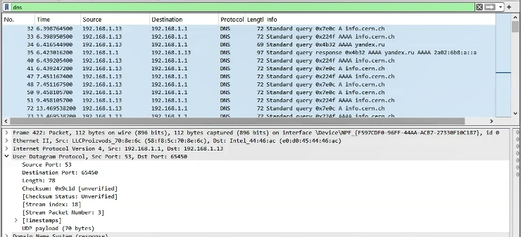
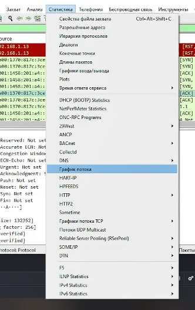
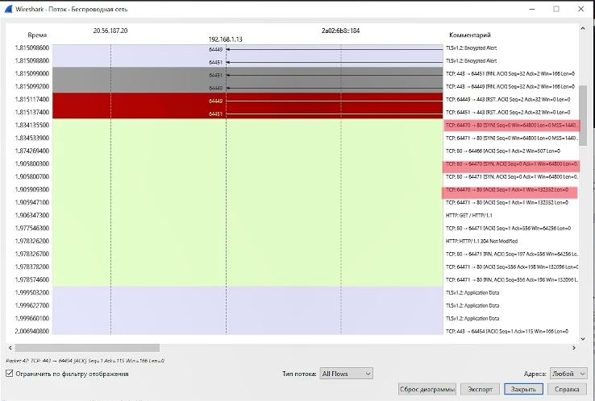

# Цель работы

Изучение посредством Wireshark кадров Ethernet, анализ UDP протоколов
транспортного и прикладного уровней стека TCP/IP.

# Задание

MAC-адресация

1.  Изучение возможностей команды ipconfig для ОС типа Windows (ifconfig
    для систем типа Linux).
2.  Определение MAC-адреса устройства и его типа.

Анализ кадров канального уровня в Wireshark

1.  Установить на домашнем устройстве Wireshark.
2.  С помощью Wireshark захватить и проанализировать пакеты ARP и ICMP в
    части кадров канального уровня.

Анализ протоколов транспортного уровня в Wireshark

1.  С помощью Wireshark захватить и проанализировать пакеты HTTP, DNS в
    части заголовков и информации протоколов TCP, UDP, QUIC.

Анализ handshake протокола TCP в Wireshark

1.  С помощью Wireshark проанализировать handshake протокола TCP.

# Выполнение лабораторной работы

## MAC-адресация

1.  С помощью команды ipconfig для ОС Windows выведите информацию о
    текущем сетевом соединении. Используйте разные опции команды.

{#fig:001 width="60%"}

{#fig:002 width="60%"}

{#fig:003 width="60%"}

{#fig:004 width="60%"}

{#fig:005 width="60%"}

Вывод:\
ipconfig /? --- выводит справку по команде и список всех её параметров.\
ipconfig /all --- показывает подробную информацию: MAC-адреса, DHCP,
DNS-серверы, аренда адреса и т.д.\
ipconfig --- показывает базовую информацию о сетевых адаптерах:
IP-адрес, маску подсети и основной шлюз.

2.  Определите MAC-адреса сетевых интерфейсов на вашем компьютере.

В выводе команды ipconfig /all смотрим строку: "Физический адрес: E0 -
D0 - 45 - 44 - 46 - AC".

{#fig:026 width="60%"}

3.  Опишите структуру MAC-адресов вашего устройства.

Какая часть адреса идентифицирует производителя? - первые 3 байта (E0 -
D0 - 45)\
Какая часть адреса идентифицирует сетевой интерфейс? - последнипе 3
байта (44 - 46 - AC)\
Определите, каким является адрес --- индивидуальным или групповым? -
индивидуальный, тк первый младший бит первого байта в двоичной системе
равен 0 (E0 = 1110 000**0**)\
Определите, каким является адрес - глобально администрируемым или
локально администрируемым? - глобально администрируемый, тк второй
младший бит первого байта в двоичной системе равен 0 (E0 = 1110
00**0**0)

## Анализ кадров канального уровня в Wireshark

1.  Установите на вашем устройстве Wireshark.
2.  Запустите Wireshark. Выберите активный на вашем устройстве сетевой
    интерфейс.
3.  На вашем устройстве в консоли определите с помощью команды ipconfig
    для ОС типа Windows IP-адрес вашего устройства (IPv4-адрес:
    192.168.1.13 (основной)) и шлюз по умолчанию (Основной шлюз:
    192.168.1.1).

{#fig:006
width="60%"}

4.  На вашем устройстве в консоли с помощью команды ping адрес_шлюза
    пропингуйте шлюз по умолчанию.

{#fig:007 width="60%"}

5.  В Wireshark остановите захват трафика. В строке фильтра пропишите
    arp or icmp. Убедитесь, что в списке пакетов отобразятся только
    пакеты ARP или ICMP, в частности пакеты, которые были сгенерированы
    с помощью команды ping.

{#fig:08 width="60%"}

6.  Выберите первый указанный кадр ICMP --- эхо-запрос.

{#fig:09 width="60%"}

{#fig:010 width="60%"}

{#fig:011 width="60%"}

Длина кадра - Frame Length: 74 bytes (592 bits)\
K какому типу Ethernet относится кадр - Ethernet II\
MAC-адреса источника - Source: Intel_44:46:ac (e0:d0:45:44:46:ac)\
MAC-адреса шлюза - Destination: LLCProizvods_70:8e:6c
(58:f8:5c:70:8e:6c)\
Тип MAC-адресов - индивидуальные, тк у обоих адресов младший бит первого
байта равен 0 (e0 = 1110 0000, 58 = 0101 1000)

6.  Выберите второй указанный кадр ICMP --- эхо-ответ.

{#fig:012 width="60%"}

Длина кадра - Frame Length: 78 bytes (624 bits)\
K какому типу Ethernet относится кадр - Ethernet II\
MAC-адреса источника - Source: LLCProizvods_70:8e:6c
(58:f8:5c:70:8e:6c)\
MAC-адреса шлюза - Destination: Intel_44:46:ac (e0:d0:45:44:46:ac)\
Тип MAC-адресов - индивидуальные, тк у обоих адресов младший бит первого
байта равен 0 (e0 = 1110 0000, 58 = 0101 1000)

7.  Изучите кадры данных протокола ARP. Изучите данные в полях заголовка
    Ethernet II.

{#fig:013
width="60%"}

Основная информация в Ethernet 2 - адреса Source (источника) и
Destination (получаетля).

8.  Начните новый процесс захвата трафика в Wireshark. На вашем
    устройстве пропингуйте какой-нибудь известный вам адрес: ping ya.ru.

{#fig:014 width="60%"}

9.  В Wireshark остановите захват трафика. Изучите запросы и ответы
    протоколов ARP и ICMP. Определите MAC-адреса источника и получателя,
    определите тип MAC-адресов.

{#fig:015 width="60%"}

При ping ya.ru на исходящих ICMP-запросах :\
- Source MAC --- MAC устройства: e0:d0:45:44:46:ac (Intel_44:46:ac)\
- Destination MAC --- MAC шлюза: 58:f8:5c:70:8e:6c
(LLCProizvods_70:8e:6c)

При ping ya.ru на ответных ICMP-запросах MAC-адреса будут обратными:\
- Source MAC --- MAC устройства: 58:f8:5c:70:8e:6c
(LLCProizvods_70:8e:6c)\
- Destination MAC --- MAC шлюза: e0:d0:45:44:46:ac (Intel_44:46:ac)

## Анализ протоколов транспортного уровня в Wireshark

1.  Запустите Wireshark. Выберите активный сетевой интерфейс. Убедитесь,
    что начался процесс захвата трафика.
2.  В браузере перейдите на сайт, работающий по протоколу HTTP (CERN
    http://info.cern.ch/). Поперемещайтесь по ссылкам или разделам сайта
    в браузере.

{#fig:016
width="60%"}

3.  В строке фильтра укажите http и проанализируйте информацию по
    протоколу TCP в случае запросов и ответов.

{#fig:017
width="60%"}

Информация по протоколу TCP (для выбранного пакета):\
- Порты: Source 55085 → Destination 80 (HTTP)\
- Флаги: PSH, ACK (0x018)\
- Seq = 1, Ack = 1, Len = 469 (данные)\
- Соединение установлено (Complete, WITH_DATA)\
- Окно: 517, Window Scale: 256\
- Контрольная сумма: unverified (checksum offload)

4.  В строке фильтра укажите dns и проанализируйте информацию по
    протоколу UDP в случае запросов и ответов.

{#fig:018 width="60%"}

Информация по протоколу UDP (для выбранного пакета):\
- Порты: Source 53 → Destination 65458 (DNS)\
- Length: 78\
- Checksum: 0x9c9d (unverified, Checksum Status: Unverified)\
- Stream Index: 18\
- UDP payload (78 bytes)\
- Тип пакета: DNS Standard query (0x7e6c A info.cern.ch)

5.  В строке фильтра укажите quic и проанализируйте информацию по
    протоколу quic в случае запросов и ответов.

{#fig:019
width="60%"}

{#fig:020
width="60%"}

Информация по протоколу UDP (для выбранного пакета):\
- Packet Type: Handshake (2)\
- Version: 1 (0x00000001)\
- Header Form: Long Header\
- Destination Connection ID: 0b6b2f28141eb16\
- Source Connection ID: нет (длина 0)\
- Packet Length: 39\
- Шифрование: payload зашифрован, расшифровать не удалось (Secrets are
not available)

6.  Остановите захват трафика в Wireshark.

## Анализ handshake протокола TCP в Wireshark

1.  Запустите Wireshark. Выберите активный сетевой интерфейс.
2.  На вашем устройстве используйте соединение по HTTP с каким-то сайтом
    для захвата в Wireshark пакетов TCP (сайт - CERN
    http://info.cern.ch/).
3.  В Wireshark проанализируйте handshake протокола TCP.

![Рис. 22: handshake, пакет \[SYN\]](image/21.PNG){#fig:021 width="60%"}

![Рис. 23: handshake, пакет \[SYN, ACK\]](image/22.PNG){#fig:022
width="60%"}

![Рис. 24: handshake, пакет \[ACK\]](image/23.PNG){#fig:023 width="60%"}

в Wireshark, TCP-соединение состоит из 3 пакетов (three-way handshake)
:\
- SYN --- запрос клиента на установку соединения (клиент → сервер).\
- SYN, ACK --- сервер подтверждает получение запроса и соглашается на
соединение (сервер → клиент).\
- ACK --- клиент подтверждает ответ сервера, соединение установлено
(клиент → сервер).

4.  В Wireshark в меню «Статистика» выберете «График Потока». В отчёте
    приведите пояснения по изменениям значений соответствующих сообщений
    при установлении соединения по TCP.

{#fig:024
width="60%"}

{#fig:025 width="60%"}

На графике потока видим отображение handshake:\
- SYN --- запрос клиента (порт 64470 → 80). Значение Seq = 0.\
- SYN, ACK --- согласие сервера (порт 80 → 64470). Значение Seq = 0, Ack
= 1.\
- ACK --- подтверждение клиента (порт 64470 → 80). Значение Seq = 1, Ack
= 1.\
Соединение установлено.

5.  Остановите захват трафика в Wireshark

# Выводы

В ходе выполнения домашней работы № 3 мне удалось изучить посредством
Wireshark кадры Ethernet, анализ UDP протоколов транспортного и
прикладного уровней стека TCP/IP.
